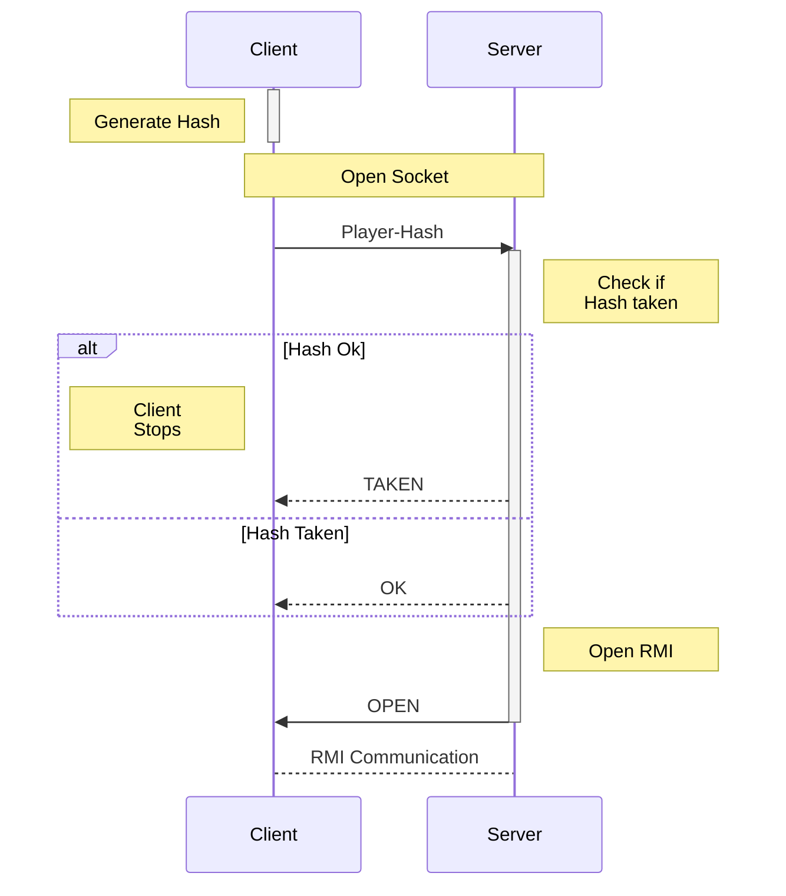
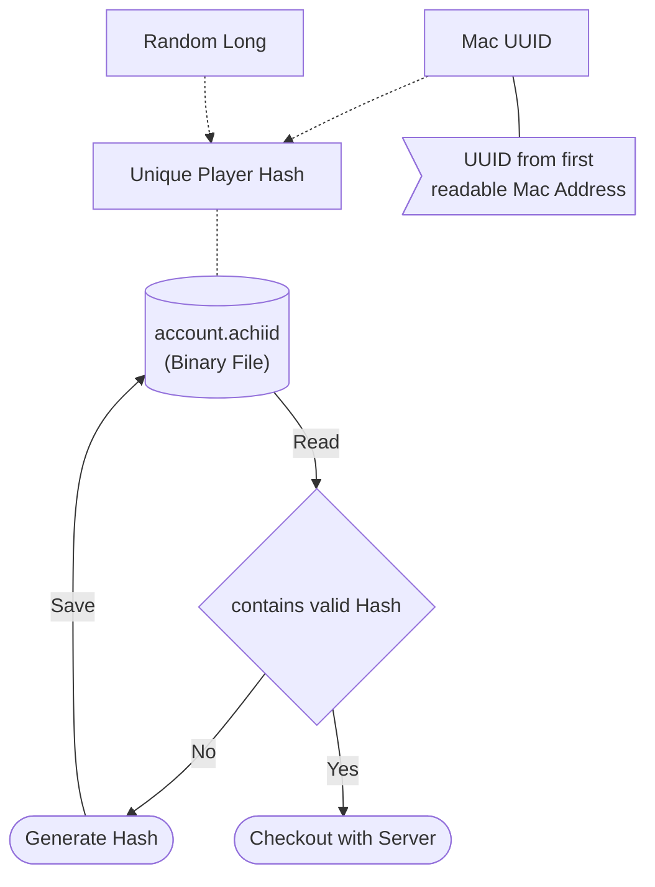
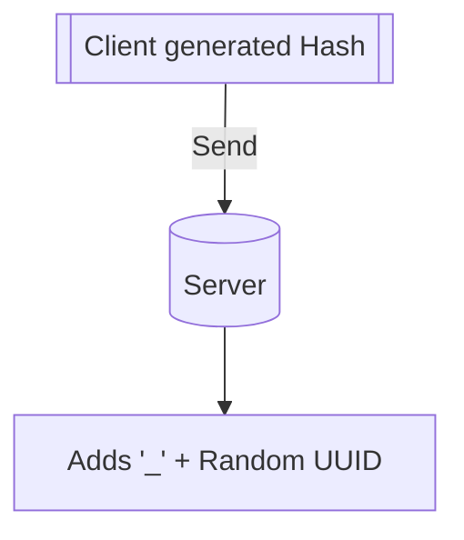

# The Achis Project Ideas/Concepts
Development file in which I note and think through Concepts of ideas.
It uses mermaid diagrams which are not supported by Github.
## Concepts

### Client-Server Connection Handshake

### User Unique Ids

### ~~Handle same Hash; Server-side~~

