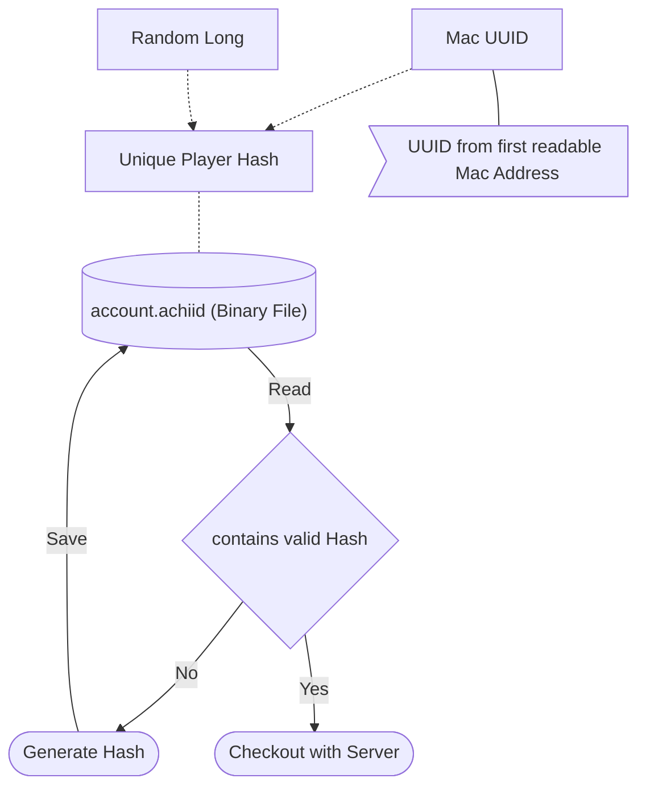
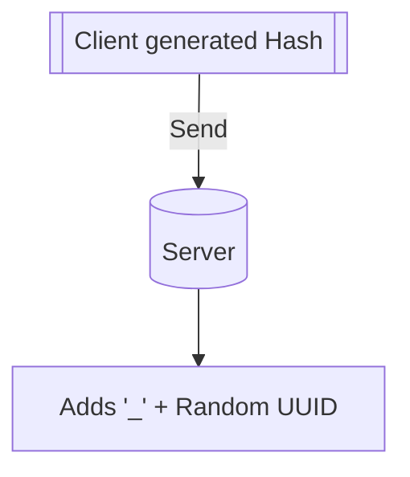

# The Achis Project Ideas/Concepts

## Concepts

### User Unique Ids

```mermaid
graph TD
	playerHash[Unique Player Hash]
	macUUID[Mac UUID]
	macUUIDNote>UUID from first readable Mac Address]
	rdmLong[Random Long]
	playerHashFile[("account.achiid (Binary File)")]
	genHash([Generate Hash])
	
	macUUID -.-> playerHash
    macUUID --- macUUIDNote 
	rdmLong -.-> playerHash
	playerHash -.- playerHashFile
	playerHashFile -->|Read| ifExists{contains valid Hash}
	ifExists -->|No| genHash
	genHash -->|Save| playerHashFile
	ifExists -->|Yes| server([Checkout with Server])
	

```

### Handle same Hash; Server-side

```mermaid
graph TD
	client[[Client generated Hash]]
	
	client -->|Send| server[(Server)]
	server --> action1["Adds '_' + Random UUID"]
```
